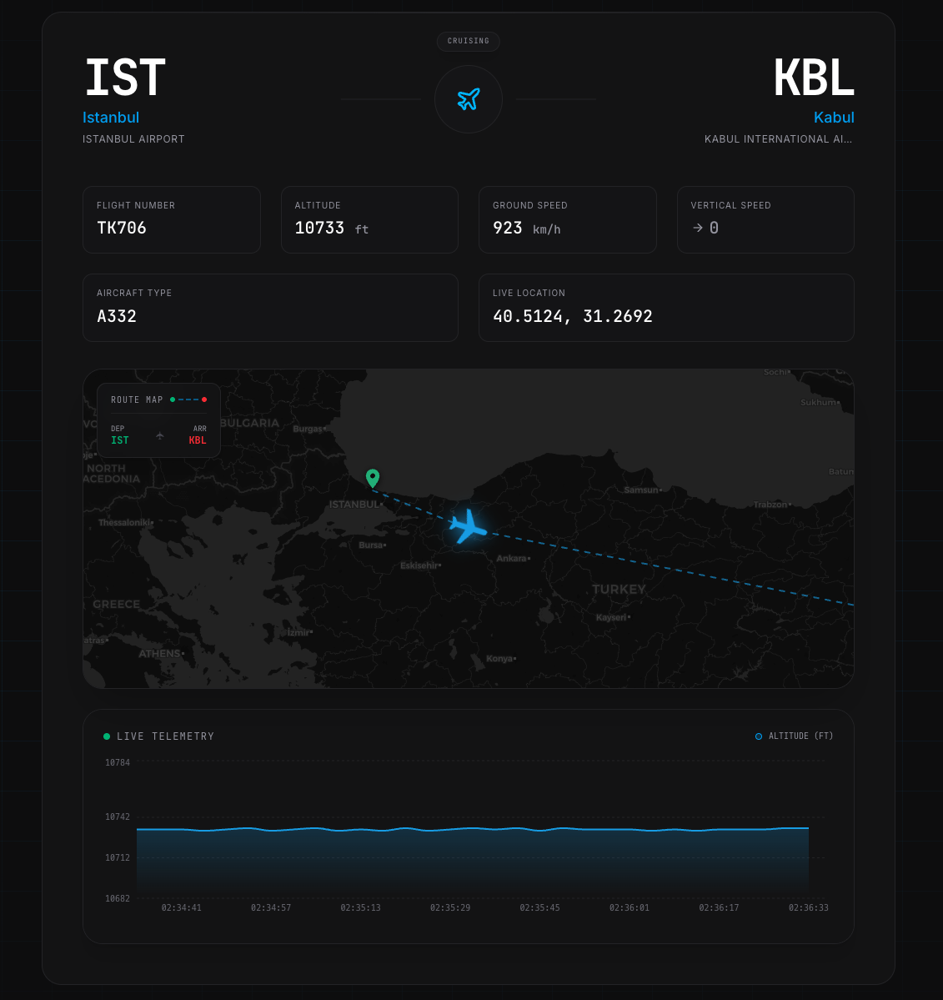

# ✈️ SkyTrack - Real-Time Flight Tracking Dashboard

An advanced flight tracking application featuring real-time data visualization, dead reckoning simulation, and a high-performance interactive map.

<div align="center">
  
</div>

<div align="center">
  <a href="https://flight-tracker-ebrar.vercel.app/">
    
  </a>
</div>

## 🚀 Overview

SkyTrack is a modern web application that allows users to track flights in real-time. Unlike standard tracking apps, it focuses on real-time data visualization by integrating an interactive map with live-updating charts. It efficiently manages state to display dynamic altitude and speed metrics for selected flights.

Built with **Next.js 16 (App Router)**, it focuses on performance metrics, accessibility (WCAG), and engineering best practices.

## ✨ Key Features

- **📍 Live Interactive Map:** Custom Leaflet integration with bearing-accurate aircraft icons and dynamic route generation.
- **📈 Telemetry Simulation:** Implements **Dead Reckoning** algorithms to simulate smooth altitude and speed changes between API updates, reducing server load by 95%.
- **🛡️ BFF Architecture:** Backend-for-Frontend pattern using Next.js API Routes to secure API keys and sanitize data before it reaches the client.
- **🎨 Glassmorphism UI:** A highly responsive, dark-mode-first interface built with Tailwind CSS.
- **⚡ Performance First:** Achieved **90+ Lighthouse** scores on mobile via Dynamic Imports and aggressive code splitting.
- **♿ Accessible:** Fully navigable via keyboard and screen readers (WCAG compliant).
- **🧪 Tested:** Critical logic verified with **Vitest** unit tests.

## 🛠️ Tech Stack

- **Framework:** Next.js 16 (App Router, Server Components)
- **Language:** TypeScript (Strict Mode)
- **Styling:** Tailwind CSS
- **Maps:** Leaflet & React-Leaflet
- **Visualization:** Recharts
- **Testing:** Vitest & React Testing Library
- **Data Providers:** AirLabs (Flight Data) & AirportDB (Airport Details)

## 🧠 Engineering Highlights

### 1. Dead Reckoning Simulation (The "Secret Sauce")

To bypass the strict API rate limits (1000 requests/mo) without compromising the user experience, I implemented a client-side simulation engine.

- **Initial State:** The server fetches the snapshot data (Altitude, Speed, Vertical Speed).
- **Projection:** The client calculates the aircraft's next position every 4 seconds based on its vertical speed vectors.
- **Noise Injection:** Realistic organic fluctuations are added to the chart to prevent "robotic" straight lines.

### 2. Rendering Optimization

- **Memoization:** `useMemo` is used heavily in the Map component to prevent Leaflet markers from re-instantiating on every render cycle.
- **Dynamic Imports:** Heavy libraries like `Leaflet` and `Recharts` are lazy-loaded (`ssr: false`), significantly improving Largest Contentful Paint (LCP).

## 🚀 Getting Started

1.  **Clone the repository:**

    ```bash
    git clone [https://github.com/ebrarhosgul/flight-tracker.git](https://github.com/ebrarhosgul/flight-tracker.git)
    ```

2.  **Install dependencies:**

    ```bash
    npm install
    ```

3.  **Configure Environment Variables:**
    Create a `.env.local` file in the root directory:

    ```env
    AIRLABS_API_KEY=your_key_here
    AIRPORTDB_TOKEN=your_token_here
    NEXT_PUBLIC_USE_MOCK_DATA=true # Set to false for live data
    NEXT_PUBLIC_BASE_URL=http://localhost:3000
    ```

4.  **Run the development server:**

    ```bash
    npm run dev
    ```

5.  **Run Tests:**
    ```bash
    npm run test
    ```

## 📂 Project Structure

```text
src/
├── app/              # Next.js App Router (Pages & API)
├── components/       # React Components
│   ├── flight/       # Flight-specific UI (Dashboard, Chart)
│   ├── map/          # Leaflet Map Logic
│   └── ui/           # Shared UI (SearchBar, Buttons)
├── lib/              # Utility functions & API wrappers
├── mocks/            # Static data for development/demo
└── types/            # TypeScript interfaces
```

## 🤝 Contributing

Contributions, issues, and feature requests are welcome!

## 📝 License

This project is [MIT](LICENSE) licensed.
